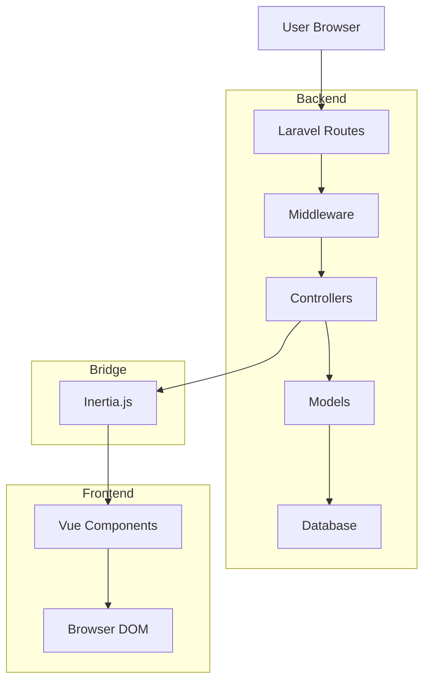
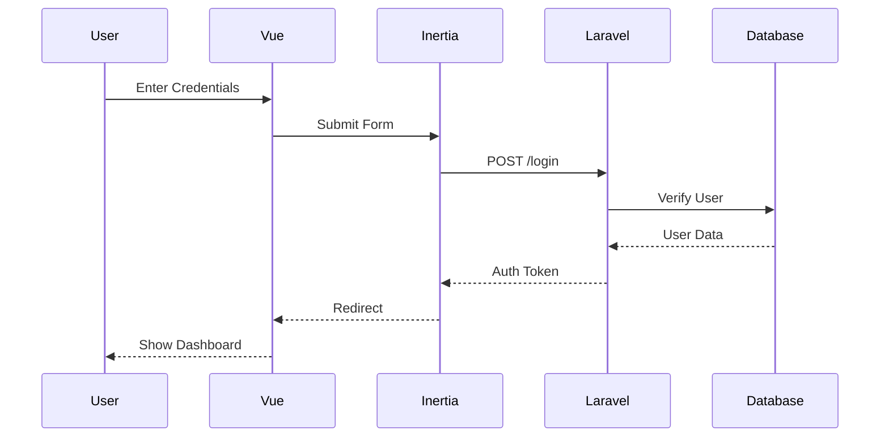
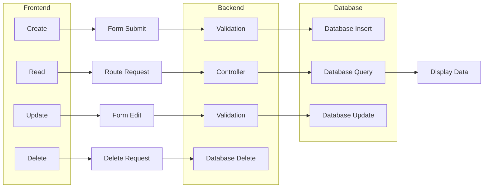
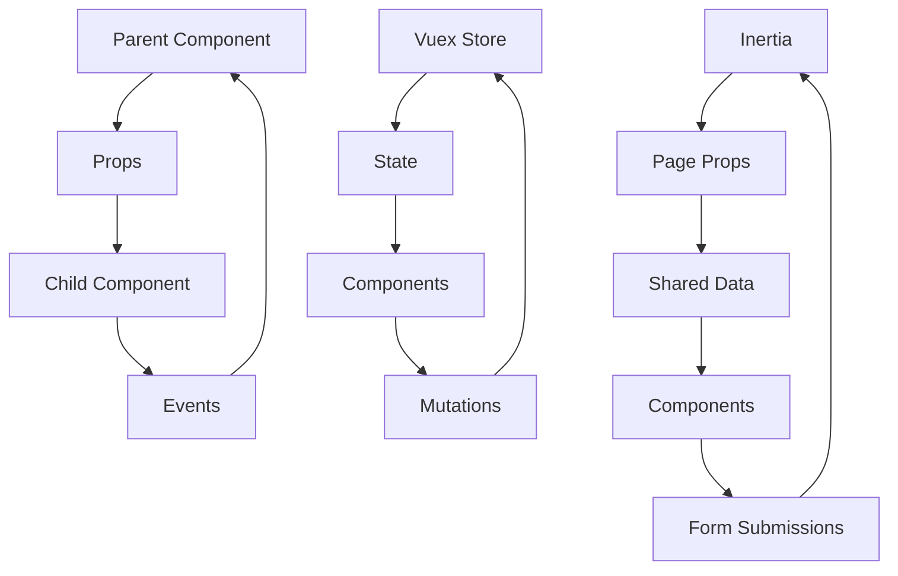
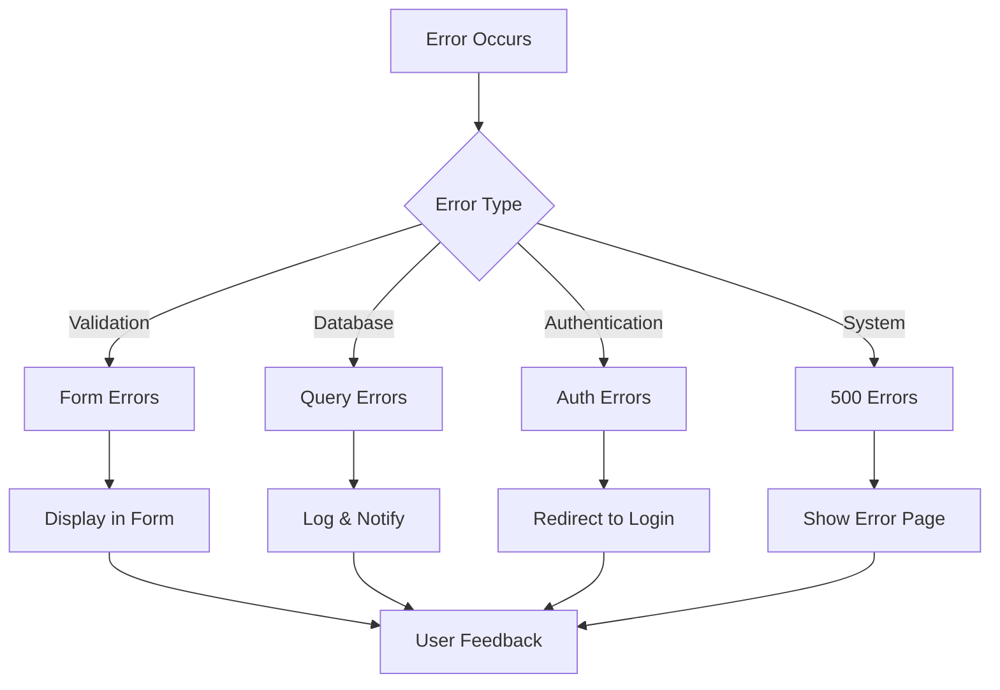
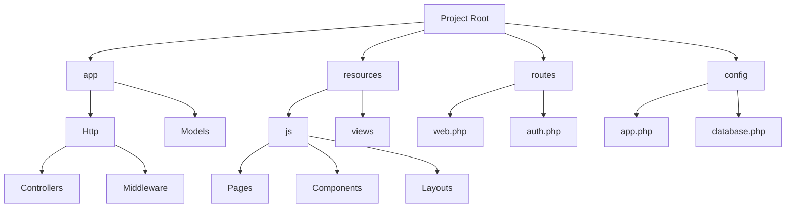
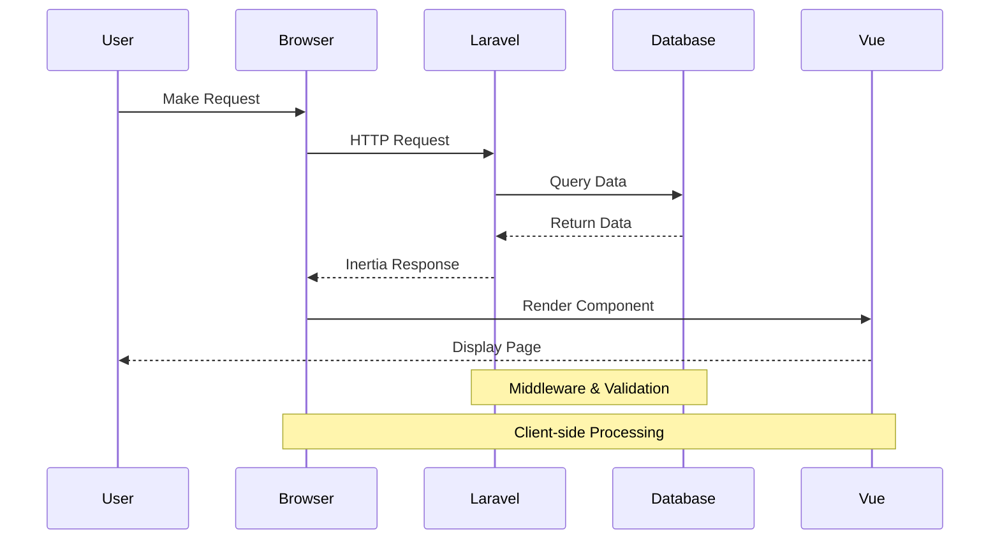
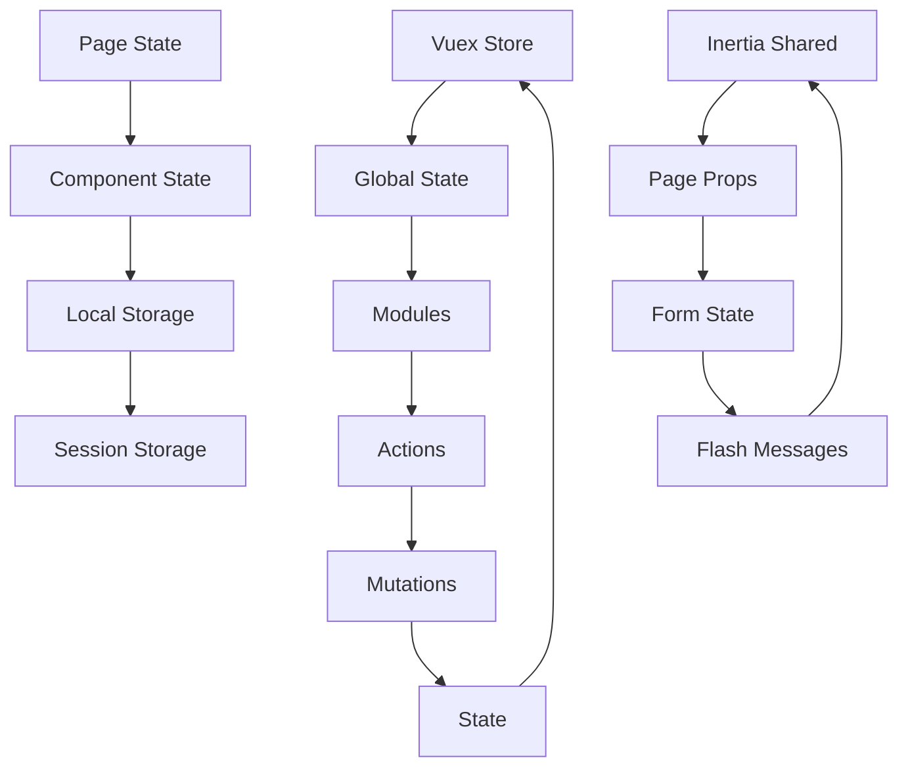

# Inventory Management System

A modern inventory management system built with Laravel, Vue.js, and Inertia.js.

## Architecture Overview

This project uses a modern stack combining Laravel (backend), Vue.js (frontend), and Inertia.js (bridge) to create a seamless single-page application experience.

### Technology Stack

-   **Backend**: Laravel 10.x
-   **Frontend**: Vue.js 3.x
-   **Bridge**: Inertia.js
-   **Database**: MySQL/PostgreSQL
-   **Authentication**: Laravel Sanctum

## Architecture Diagrams

### 1. Overall Architecture Flow

```
┌─────────────────┐     ┌─────────────────┐     ┌─────────────────┐
│                 │     │                 │     │                 │
│   User Browser  │────▶│   Laravel App   │────▶│   Inertia.js    │
│                 │     │                 │     │                 │
└─────────────────┘     └─────────────────┘     └────────┬────────┘
                                                         │
                                                         ▼
┌─────────────────┐     ┌─────────────────┐     ┌─────────────────┐
│                 │     │                 │     │                 │
│   Vue.js App    │◀────│   Vue Router    │◀────│   Vue Components│
│                 │     │                 │     │                 │
└─────────────────┘     └─────────────────┘     └─────────────────┘
```

### 2. Request Flow

```
┌─────────────┐     ┌─────────────┐     ┌─────────────┐     ┌─────────────┐
│             │     │             │     │             │     │             │
│  HTTP       │     │  Laravel    │     │  Inertia    │     │  Vue.js     │
│  Request    │────▶│  Routes     │────▶│  Controller │────▶│  Component  │
│             │     │             │     │             │     │             │
└─────────────┘     └─────────────┘     └─────────────┘     └─────────────┘
```

### 3. Data Flow

```
┌─────────────────────────────────────────────────────────────────────────┐
│                              Laravel Backend                            │
├─────────────┐     ┌─────────────┐     ┌─────────────┐     ┌─────────────┐
│             │     │             │     │             │     │             │
│  Database   │────▶│  Models     │────▶│  Controllers│────▶│  Inertia    │
│             │     │             │     │             │     │  Response    │
└─────────────┘     └─────────────┘     └─────────────┘     └─────────────┘
                                                                    │
                                                                    ▼
┌─────────────────────────────────────────────────────────────────────────┐
│                              Vue.js Frontend                            │
├─────────────┐     ┌─────────────┐     ┌─────────────┐     ┌─────────────┐
│             │     │             │     │             │     │             │
│  Inertia    │────▶│  Vue        │────▶│  Vue        │────▶│  Browser    │
│  Request    │     │  Components │     │  Router     │     │  DOM        │
└─────────────┘     └─────────────┘     └─────────────┘     └─────────────┘
```

## Key Features

### Authentication Flow

```
┌─────────────┐     ┌─────────────┐     ┌─────────────┐     ┌─────────────┐
│             │     │             │     │             │     │             │
│  Login      │────▶│  Auth       │────▶│  Session    │────▶│  Protected  │
│  Form       │     │  Middleware │     │  Creation   │     │  Routes     │
│             │     │             │     │             │     │             │
└─────────────┘     └─────────────┘     └─────────────┘     └─────────────┘
```

### Form Handling

```
┌─────────────┐     ┌─────────────┐     ┌─────────────┐     ┌─────────────┐
│             │     │             │     │             │     │             │
│  Vue Form   │────▶│  Inertia    │────▶│  Laravel    │────▶│  Database   │
│  Submit     │     │  Request    │     │  Controller │     │  Update     │
│             │     │             │     │             │     │             │
└─────────────┘     └─────────────┘     └─────────────┘     └─────────────┘
```

## Project Structure

```
project/
├── app/
│   ├── Http/
│   │   ├── Controllers/    # Application controllers
│   │   └── Middleware/     # Custom middleware
│   └── Models/             # Eloquent models
├── resources/
│   └── js/
│       ├── Pages/          # Vue page components
│       ├── Components/     # Reusable Vue components
│       └── Layouts/        # Vue layout components
└── routes/
    ├── web.php             # Web routes
    └── auth.php            # Authentication routes
```

## Getting Started

### Prerequisites

-   PHP 8.1 or higher
-   Node.js 16.x or higher
-   Composer
-   MySQL/PostgreSQL

### Installation

1. Clone the repository

```bash
git clone https://github.com/yourusername/inventory.git
cd inventory
```

2. Install PHP dependencies

```bash
composer install
```

3. Install JavaScript dependencies

```bash
npm install
```

4. Create environment file

```bash
cp .env.example .env
```

5. Generate application key

```bash
php artisan key:generate
```

6. Run migrations

```bash
php artisan migrate
```

7. Start the development server

```bash
php artisan serve
npm run dev
```

## Key Concepts

### 1. Inertia.js Bridge

Inertia.js acts as a bridge between Laravel and Vue.js, allowing you to:

-   Build single-page applications without building an API
-   Share data between backend and frontend seamlessly
-   Handle page transitions without full reloads

### 2. Component Communication

```
┌─────────────────┐     ┌─────────────────┐     ┌─────────────────┐
│                 │     │                 │     │                 │
│  Parent         │     │  Inertia        │     │  Child          │
│  Component      │────▶│  Page Props     │────▶│  Component      │
│                 │     │                 │     │                 │
└─────────────────┘     └─────────────────┘     └─────────────────┘
```

### 3. State Management

```
┌─────────────────────────────────────────────────────────────────────────┐
│                              State Management                           │
├─────────────┐     ┌─────────────┐     ┌─────────────┐     ┌─────────────┐
│             │     │             │     │             │     │             │
│  Page       │     │  Shared     │     │  Flash      │     │  Form       │
│  Props      │     │  Data       │     │  Messages   │     │  State      │
│             │     │             │     │             │     │             │
└─────────────┘     └─────────────┘     └─────────────┘     └─────────────┘
```

## Best Practices

1. **Controllers**

    - Keep controllers thin
    - Use form requests for validation
    - Return Inertia responses

2. **Components**

    - Use composition API
    - Keep components focused
    - Use props for data passing

3. **State Management**

    - Use page props for server data
    - Use shared data for global state
    - Use form state for user input

4. **Routing**
    - Use named routes
    - Group related routes
    - Use middleware appropriately

## Contributing

1. Fork the repository
2. Create your feature branch
3. Commit your changes
4. Push to the branch
5. Create a Pull Request

## License

This project is licensed under the MIT License - see the LICENSE file for details.

## Code Examples

### 1. Controller Example

```php
// app/Http/Controllers/BatchController.php
namespace App\Http\Controllers;

use App\Models\Batch;
use Inertia\Inertia;

class BatchController extends Controller
{
    public function index()
    {
        return Inertia::render('Batches/Index', [
            'batches' => Batch::with('farmer')->get(),
            'filters' => request()->only(['search', 'status'])
        ]);
    }

    public function store(Request $request)
    {
        $validated = $request->validate([
            'farmer_id' => 'required|exists:farmers,id',
            'batch_name' => 'required|string|max:255',
            'start_date' => 'required|date',
            'expected_end_date' => 'required|date|after:start_date',
        ]);

        Batch::create($validated);

        return redirect()->route('batches.index')
            ->with('success', 'Batch created successfully.');
    }
}
```

### 2. Vue Component Example

```vue
<!-- resources/js/Pages/Batches/Index.vue -->
<script setup>
import { Head, Link } from "@inertiajs/vue3";
import AuthenticatedLayout from "@/Layouts/AuthenticatedLayout.vue";

defineProps({
    batches: Array,
    filters: Object,
});
</script>

<template>
    <Head title="Batches" />
    <AuthenticatedLayout>
        <template #header>
            <h2 class="font-semibold text-xl text-gray-800 leading-tight">
                Batches
            </h2>
        </template>

        <div class="py-12">
            <div class="max-w-7xl mx-auto sm:px-6 lg:px-8">
                <div class="bg-white overflow-hidden shadow-sm sm:rounded-lg">
                    <div class="p-6 text-gray-900">
                        <Link
                            :href="route('batches.create')"
                            class="btn btn-primary"
                        >
                            Create New Batch
                        </Link>

                        <table class="mt-4">
                            <thead>
                                <tr>
                                    <th>Batch Name</th>
                                    <th>Farmer</th>
                                    <th>Start Date</th>
                                    <th>Status</th>
                                    <th>Actions</th>
                                </tr>
                            </thead>
                            <tbody>
                                <tr v-for="batch in batches" :key="batch.id">
                                    <td>{{ batch.batch_name }}</td>
                                    <td>{{ batch.farmer.name }}</td>
                                    <td>{{ batch.start_date }}</td>
                                    <td>{{ batch.batch_status }}</td>
                                    <td>
                                        <Link
                                            :href="
                                                route('batches.edit', batch.id)
                                            "
                                        >
                                            Edit
                                        </Link>
                                    </td>
                                </tr>
                            </tbody>
                        </table>
                    </div>
                </div>
            </div>
        </div>
    </AuthenticatedLayout>
</template>
```

### 3. Form Handling Example

```vue
<!-- resources/js/Pages/Batches/Create.vue -->
<script setup>
import { useForm } from "@inertiajs/vue3";

const form = useForm({
    farmer_id: "",
    batch_name: "",
    start_date: "",
    expected_end_date: "",
    batch_status: "planned",
    notes: "",
});

const submit = () => {
    form.post(route("batches.store"));
};
</script>

<template>
    <form @submit.prevent="submit">
        <!-- Form fields -->
        <div v-if="form.errors.farmer_id" class="text-red-500">
            {{ form.errors.farmer_id }}
        </div>
        <button type="submit" :disabled="form.processing">Create Batch</button>
    </form>
</template>
```

## Troubleshooting Guide

### Common Issues and Solutions

1. **Inertia.js Page Not Found**

    ```bash
    # Error: The page component was not found
    ```

    Solution:

    - Check if the component exists in the correct directory
    - Verify the component name matches the route
    - Clear view cache: `php artisan view:clear`

2. **CSRF Token Mismatch**

    ```bash
    # Error: CSRF token mismatch
    ```

    Solution:

    - Ensure `@csrf` is included in forms
    - Check if session is properly configured
    - Verify `APP_KEY` is set in `.env`

3. **Vue Component Not Rendering**

    ```bash
    # Component not showing or errors in console
    ```

    Solution:

    - Check browser console for errors
    - Verify all required props are passed
    - Ensure component is properly registered

4. **Database Connection Issues**
    ```bash
    # Error: Could not connect to database
    ```
    Solution:
    - Verify database credentials in `.env`
    - Check if database server is running
    - Ensure database exists and is accessible

### Debugging Tools

1. **Laravel Debugbar**

    ```bash
    composer require barryvdh/laravel-debugbar --dev
    ```

2. **Vue DevTools**

    - Install browser extension
    - Use for component inspection
    - Monitor state changes

3. **Network Tab**
    - Check Inertia requests
    - Verify payload data
    - Monitor response headers

## Deployment Instructions

### 1. Production Environment Setup

```bash
# Install dependencies
composer install --optimize-autoloader --no-dev
npm install
npm run build

# Set up environment
cp .env.example .env
php artisan key:generate

# Configure database
php artisan migrate --force

# Set up storage
php artisan storage:link

# Cache configuration
php artisan config:cache
php artisan route:cache
php artisan view:cache
```

### 2. Server Requirements

-   PHP 8.1 or higher
-   Node.js 16.x or higher
-   MySQL 5.7+ or PostgreSQL 9.6+
-   Web server (Apache/Nginx)
-   SSL certificate (for HTTPS)

### 3. Nginx Configuration

```nginx
server {
    listen 80;
    server_name yourdomain.com;
    root /path/to/your/project/public;

    add_header X-Frame-Options "SAMEORIGIN";
    add_header X-Content-Type-Options "nosniff";

    index index.php;

    charset utf-8;

    location / {
        try_files $uri $uri/ /index.php?$query_string;
    }

    location = /favicon.ico { access_log off; log_not_found off; }
    location = /robots.txt  { access_log off; log_not_found off; }

    error_page 404 /index.php;

    location ~ \.php$ {
        fastcgi_pass unix:/var/run/php/php8.1-fpm.sock;
        fastcgi_param SCRIPT_FILENAME $realpath_root$fastcgi_script_name;
        include fastcgi_params;
    }

    location ~ /\.(?!well-known).* {
        deny all;
    }
}
```

### 4. Deployment Checklist

1. **Pre-deployment**

    - [ ] Run tests
    - [ ] Update dependencies
    - [ ] Check environment variables
    - [ ] Backup database

2. **Deployment**

    - [ ] Deploy code
    - [ ] Run migrations
    - [ ] Clear caches
    - [ ] Set up storage link

3. **Post-deployment**
    - [ ] Verify site is working
    - [ ] Check error logs
    - [ ] Monitor performance
    - [ ] Test critical features

### 5. Monitoring and Maintenance

1. **Log Monitoring**

    ```bash
    # View Laravel logs
    tail -f storage/logs/laravel.log
    ```

2. **Performance Monitoring**

    - Set up Laravel Telescope
    - Configure error tracking
    - Monitor server resources

3. **Regular Maintenance**
    - Update dependencies
    - Backup database
    - Clear old logs
    - Optimize database

## Additional Resources

### Documentation

-   [Laravel Documentation](https://laravel.com/docs)
-   [Vue.js Documentation](https://vuejs.org/guide)
-   [Inertia.js Documentation](https://inertiajs.com)

### Community Support

-   [Laravel Forums](https://laravel.io/forum)
-   [Vue.js Forum](https://forum.vuejs.org)
-   [Stack Overflow](https://stackoverflow.com)

### Development Tools

-   [Laravel Debugbar](https://github.com/barryvdh/laravel-debugbar)
-   [Vue DevTools](https://devtools.vuejs.org)
-   [Laravel Telescope](https://laravel.com/docs/telescope)

## How It Works (For Beginners)

### 1. Understanding the Basic Flow

Think of the system like a restaurant:

-   **Laravel (Backend)** is like the kitchen - it handles all the data and business logic
-   **Vue.js (Frontend)** is like the dining area - it's what users see and interact with
-   **Inertia.js** is like the waiter - it connects the kitchen and dining area smoothly

### 2. Step-by-Step Explanation

#### A. When Someone Visits Your Website

1. **User Types URL (e.g., yourwebsite.com/batches)**

    ```mermaid
    graph LR
    A[User Browser] --> B[Laravel Route]
    B --> C[Inertia.js]
    C --> D[Vue Component]
    ```

2. **What Happens Behind the Scenes**
    - Browser sends request to Laravel
    - Laravel checks if user is logged in
    - Inertia.js prepares the data
    - Vue.js shows the page to user

#### B. When User Fills Out a Form

1. **User Clicks Submit**

    ```mermaid
    graph LR
    A[Form Submit] --> B[Inertia.js]
    B --> C[Laravel Controller]
    C --> D[Database]
    ```

2. **What Happens Behind the Scenes**
    - Form data is collected
    - Inertia.js sends it to Laravel
    - Laravel validates the data
    - Data is saved to database
    - User sees success message

### 3. Real-World Example: Creating a Batch

Let's follow what happens when a user creates a new batch:

1. **User Clicks "Create Batch" Button**

    ```vue
    <!-- In Vue Component -->
    <Link :href="route('batches.create')">
      Create New Batch
    </Link>
    ```

2. **Laravel Receives Request**

    ```php
    // In routes/web.php
    Route::get('/batches/create', [BatchController::class, 'create'])
        ->name('batches.create');
    ```

3. **Controller Prepares Data**

    ```php
    // In BatchController.php
    public function create()
    {
        return Inertia::render('Batches/Create', [
            'farmers' => Farmer::all()
        ]);
    }
    ```

4. **Vue Shows the Form**

    ```vue
    <!-- In Create.vue -->
    <form @submit.prevent="form.post(route('batches.store'))">
      <select v-model="form.farmer_id">
        <option v-for="farmer in farmers" :value="farmer.id">
          {{ farmer.name }}
        </option>
      </select>
      <button type="submit">Create Batch</button>
    </form>
    ```

5. **User Submits Form**

    ```php
    // In BatchController.php
    public function store(Request $request)
    {
        Batch::create($request->validate([
            'farmer_id' => 'required',
            'batch_name' => 'required'
        ]));

        return redirect()->route('batches.index')
            ->with('success', 'Batch created!');
    }
    ```

### 4. Understanding Key Concepts

#### A. What is Inertia.js?

-   It's like a magic bridge between Laravel and Vue.js
-   Makes pages load without refreshing
-   Keeps the URL in sync with what you're viewing
-   Handles all the data passing automatically

#### B. What is Vue.js?

-   It's like a smart template system
-   Makes web pages interactive
-   Updates parts of the page without reloading
-   Makes forms and user interactions smooth

#### C. What is Laravel?

-   It's like the brain of the application
-   Handles all the data and logic
-   Manages user authentication
-   Connects to the database

### 5. Common Scenarios Explained

#### A. User Login

1. User enters email/password
2. Laravel checks credentials
3. If correct, creates a session
4. User is redirected to dashboard

#### B. Viewing Data

1. User requests a page
2. Laravel gets data from database
3. Inertia.js sends data to Vue
4. Vue displays the data in a table

#### C. Updating Data

1. User edits a form
2. Vue collects the changes
3. Inertia.js sends to Laravel
4. Laravel updates the database
5. User sees success message

### 6. Tips for Understanding the Code

1. **Look for Patterns**

    - Controllers usually end with `Controller`
    - Vue components are in `.vue` files
    - Routes are defined in `web.php`

2. **Follow the Data**

    - Start at the route
    - Look at the controller
    - Check the Vue component
    - See where data is displayed

3. **Use the Browser Tools**
    - Open Developer Tools (F12)
    - Look at the Network tab
    - Check the Console for errors
    - Use Vue DevTools extension

### 7. Common Questions Answered

Q: How does data get from the database to the screen?
A:

1. Database → Laravel Model
2. Model → Controller
3. Controller → Inertia.js
4. Inertia.js → Vue Component
5. Vue Component → Screen

Q: What happens when I click a button?
A:

1. Vue handles the click
2. Inertia.js sends request
3. Laravel processes it
4. Database updates
5. Page updates without refresh

Q: How does authentication work?
A:

1. User enters credentials
2. Laravel checks them
3. If correct, creates session
4. User can access protected pages

## Visual System Flow

### 1. Complete System Architecture



### 2. Authentication Flow



### 3. Data Flow for CRUD Operations



### 4. Component Communication



### 5. Error Handling Flow



### 6. File Structure Visualization



### 7. Request Lifecycle



### 8. State Management Flow



## Docker Setup

The application uses Docker for development and deployment. The setup includes three main services:

1. **Backend (Laravel)**

    - Runs on port 8000
    - Handles API requests and server-side logic
    - Uses PHP 8.2 with necessary extensions
    - Includes Xdebug for debugging

2. **Frontend (Vue.js + Vite)**

    - Runs on port 5173
    - Handles client-side rendering and UI
    - Hot Module Replacement (HMR) enabled
    - CORS configured for development

3. **Database (MySQL)**
    - Runs on port 3306
    - Persistent storage using Docker volumes
    - Pre-configured with initial schema

### Prerequisites

-   Docker and Docker Compose installed
-   Git for version control
-   Node.js and npm (for local development)

### Getting Started

1. Clone the repository:

    ```bash
    git clone <repository-url>
    cd inventory
    ```

2. Copy environment files:

    ```bash
    cp .env.example .env
    cp .env.example.frontend .env.frontend
    ```

3. Start the containers:

    ```bash
    docker compose up -d
    ```

4. Install dependencies:

    ```bash
    # Install PHP dependencies
    docker compose exec app composer install

    # Install JavaScript dependencies
    docker compose exec frontend npm install
    ```

5. Generate application key:

    ```bash
    docker compose exec app php artisan key:generate
    ```

6. Run migrations:

    ```bash
    docker compose exec app php artisan migrate
    ```

7. Access the application:
    - Frontend: http://localhost:5173
    - Backend API: http://localhost:8000
    - Database: localhost:3306

### Development Workflow

1. **Backend Development**

    - PHP files are mounted from your local machine
    - Changes are reflected immediately
    - Use `docker compose exec app php artisan` for Laravel commands

2. **Frontend Development**

    - Vue files are mounted from your local machine
    - HMR enabled for instant updates
    - Use `docker compose exec frontend npm run dev` for Vite commands

3. **Database Management**
    - Access MySQL: `docker compose exec db mysql -u inventory_user -p`
    - Run migrations: `docker compose exec app php artisan migrate`
    - Seed data: `docker compose exec app php artisan db:seed`

### Environment Variables

1. **Backend (.env)**

    ```
    APP_ENV=local
    APP_DEBUG=true
    DB_CONNECTION=mysql
    DB_HOST=db
    DB_PORT=3306
    DB_DATABASE=inventory
    DB_USERNAME=inventory_user
    DB_PASSWORD=secret
    ```

2. **Frontend (.env.frontend)**
    ```
    NODE_ENV=development
    VITE_APP_URL=http://localhost:8000
    HOST=0.0.0.0
    PORT=5173
    ```

### Troubleshooting

1. **Port Conflicts**

    - Ensure ports 8000, 5173, and 3306 are available
    - Check running containers: `docker ps`

2. **Container Issues**

    - Rebuild containers: `docker compose build`
    - Restart services: `docker compose restart`
    - View logs: `docker compose logs -f`

3. **Database Problems**

    - Reset database: `docker compose down -v && docker compose up -d`
    - Check migrations: `docker compose exec app php artisan migrate:status`

4. **CORS Issues**
    - Verify CORS configuration in `config/cors.php`
    - Check frontend environment variables
    - Ensure correct ports are being used

### Production Deployment

1. Update environment variables:

    ```bash
    APP_ENV=production
    APP_DEBUG=false
    ```

2. Build production assets:

    ```bash
    docker compose exec frontend npm run build
    ```

3. Optimize Laravel:

    ```bash
    docker compose exec app php artisan optimize
    ```

4. Set proper permissions:
    ```bash
    docker compose exec app chmod -R 775 storage bootstrap/cache
    ```
